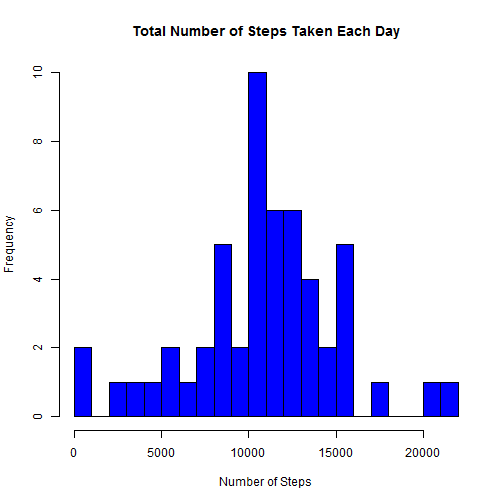
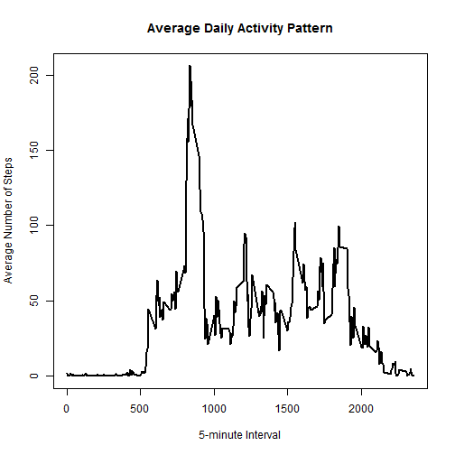
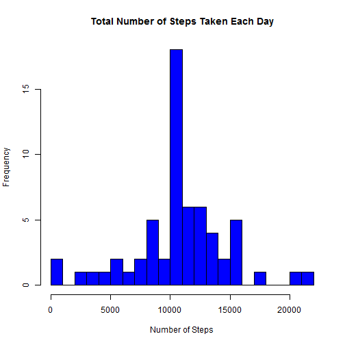
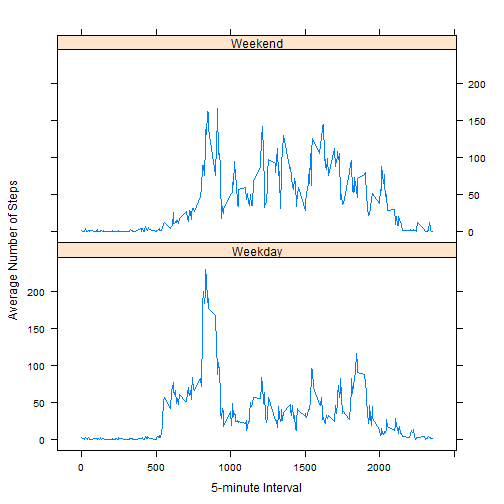

# Reproducible Research: Peer Assessment 1


## Loading and preprocessing the data

```r
originalData <- read.csv("activity.csv")
cleanData <- originalData[complete.cases(originalData), ]
```


## What is mean total number of steps taken per day?

```r
totalSteps <- aggregate(cleanData$steps, by = list(cleanData$date), FUN=sum, na.rm=TRUE)
colnames(totalSteps) <- c("Date", "Total Steps")
hist(totalSteps$"Total Steps", 
     breaks = 30, 
     main = "Total Number of Steps Taken Each Day", 
     xlab = "Number of Steps", 
     col = "blue")
```

 

```r
meanSteps <- mean(totalSteps$"Total Steps")

medianSteps <- median(totalSteps$"Total Steps")
```

The mean total number of steps taken per day is 1.0766 &times; 10<sup>4</sup>.
The median total number of steps taken per day is 10765.


## What is the average daily activity pattern?

```r
dailyPattern <- aggregate(cleanData$steps, by = list(cleanData$interval), FUN=mean, na.rm=TRUE)
colnames(dailyPattern) <- c("Interval", "Average Steps")
plot(dailyPattern$"Interval", 
     dailyPattern$"Average Steps", 
     type = 'l', 
     lwd = 2, 
     main = "Average Daily Activity Pattern", 
     xlab = "5-minute Interval", 
     ylab = "Average Number of Steps")
```

 

```r
maxInterval <- dailyPattern[which.max(dailyPattern$"Average Steps"), 1]
```

The 835 interval, on average across all the days in the dataset, contains the maximum number of step.


## Imputing missing values

```r
nMissing <- nrow(originalData)-nrow(cleanData)

imputedData <- originalData
for (i in 1:nrow(imputedData)) {
  if (is.na(imputedData[i, "steps"])){
    imputedData[i, "steps"] <- 
      dailyPattern[dailyPattern$"Interval"==imputedData[i, "interval"], "Average Steps"]
  }
}

totalStepsID <- aggregate(imputedData$steps, by = list(imputedData$date), FUN=sum, na.rm=TRUE)
colnames(totalStepsID) <- c("Date", "Total Steps")
hist(totalStepsID$"Total Steps", 
     breaks = 30, 
     main = "Total Number of Steps Taken Each Day", 
     xlab = "Number of Steps", 
     col = "blue")
```

 

```r
meanStepsID <- mean(totalStepsID$"Total Steps")

medianStepsID <- median(totalStepsID$"Total Steps")
```

The total number of rows with missing values is 2304.

The mean total number of steps taken per day with the missing data filled in is 1.0766 &times; 10<sup>4</sup>.
The median total number of steps taken per day with the missing data filled in is 1.0766 &times; 10<sup>4</sup>.

The mean is the same with the mean from the first part of the assignment. The median is different from the first part, which is the same with the mean now.

Imputing the average steps to the intervals has no impact on calculating the mean. However, it does affect the median. Dates with no values have the average total steps per day now, which makes many dates with the average total number of steps appear in the middle of the data. Therefore the mean total steps becomes the median.


## Are there differences in activity patterns between weekdays and weekends?

```r
#imputedData$day <- weekdays(as.Date(imputedData$date))
library(timeDate)
imputedData$wd <- isWeekday(imputedData$date, wday = 1:5)
imputedData$wd[imputedData$wd == TRUE] <- "Weekday"
imputedData$wd[imputedData$wd == FALSE] <- "Weekend"

compareWdWk <- aggregate(imputedData$steps, 
                         by = list(imputedData$interval, imputedData$wd), 
                         FUN=mean, na.rm=TRUE)
colnames(compareWdWk) <- c("Interval", "Weekday", "Average Steps")

weekday <- subset(compareWdWk, compareWdWk$"Weekday"=="Weekday")
weekend <- subset(compareWdWk, compareWdWk$"Weekday"=="Weekend")

# library(ggplot2)
# p1 <- ggplot(weekday, aes(x=weekday$"Interval", y=weekday$"Average Steps")) + geom_line()
# p2 <- ggplot(weekend, aes(x=weekend$"Interval", y=weekend$"Average Steps")) + geom_line()
# library(gridExtra)
# grid.arrange(p1, p2)

# par(mfrow=c(2,1))
# plot(weekday$"Interval", weekday$"Average Steps", type='l')
# plot(weekend$"Interval", weekend$"Average Steps", type='l')

library(lattice)
xyplot(compareWdWk$"Average Steps" ~ compareWdWk$Interval | compareWdWk$Weekday, 
       data = compareWdWk, 
       type = 'l', 
       layout = c(1, 2), 
       xlab = "5-minute Interval", 
       ylab = "Average Number of Steps")
```

 


